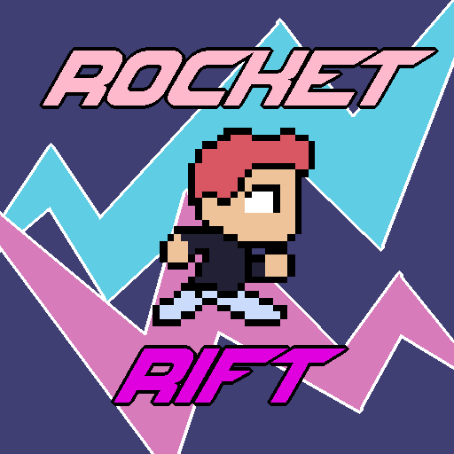

# Rocket Rift

Rocket Rift is a clone of Jetpack Joyride, made in the Godot game engine.

### Design Documents:

- [GDD](./gdd/game-design-document/gdd.md)
- [Art Bible](./gdd/art-bible/art-bible.md)
- [LDD](./gdd/level-design-document/ldd.md)
- [ADD](./gdd/audio-design-document/add.md)
