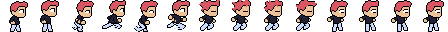
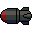
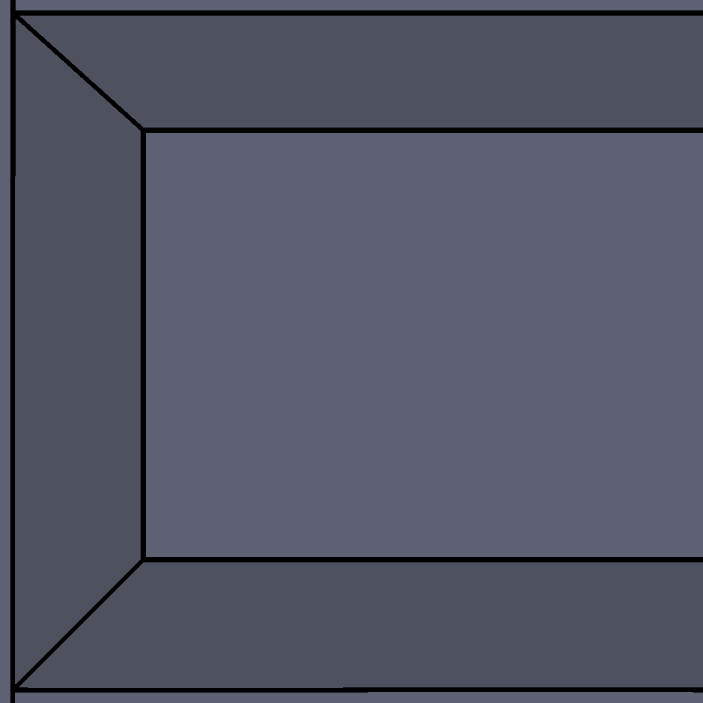
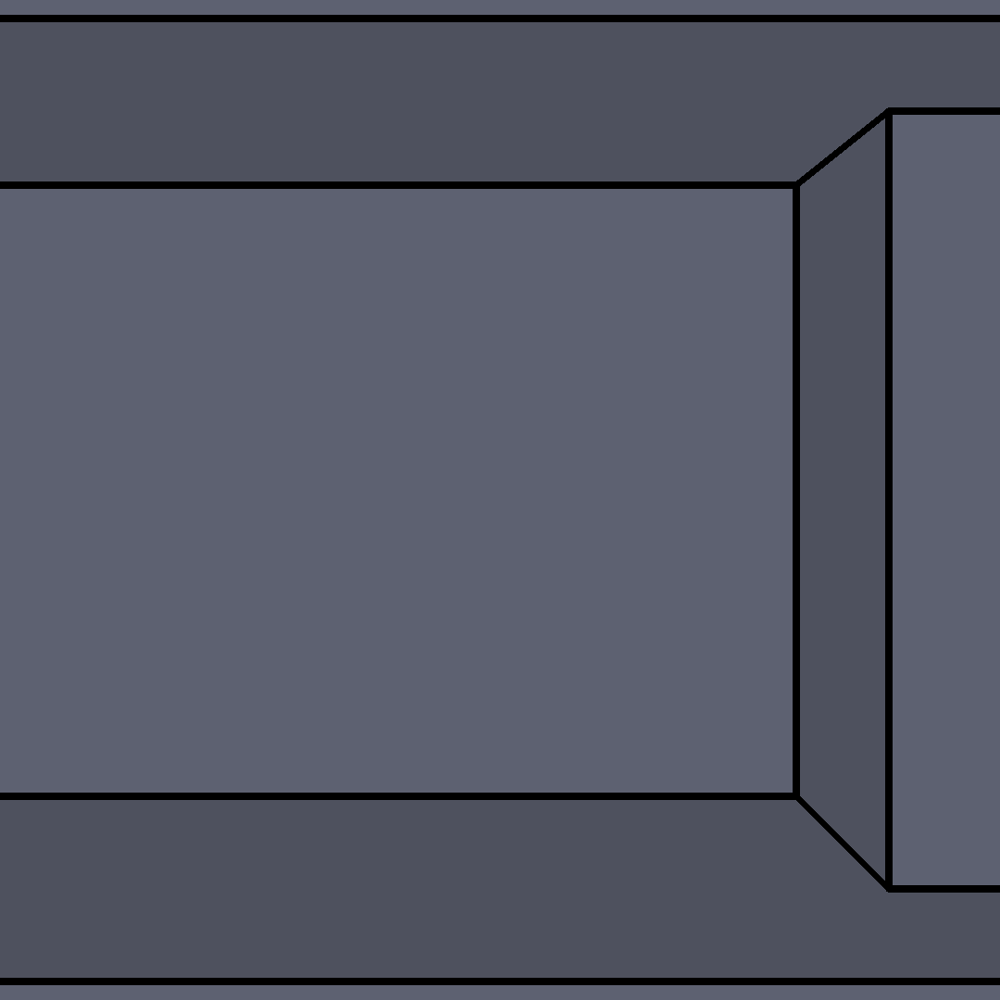
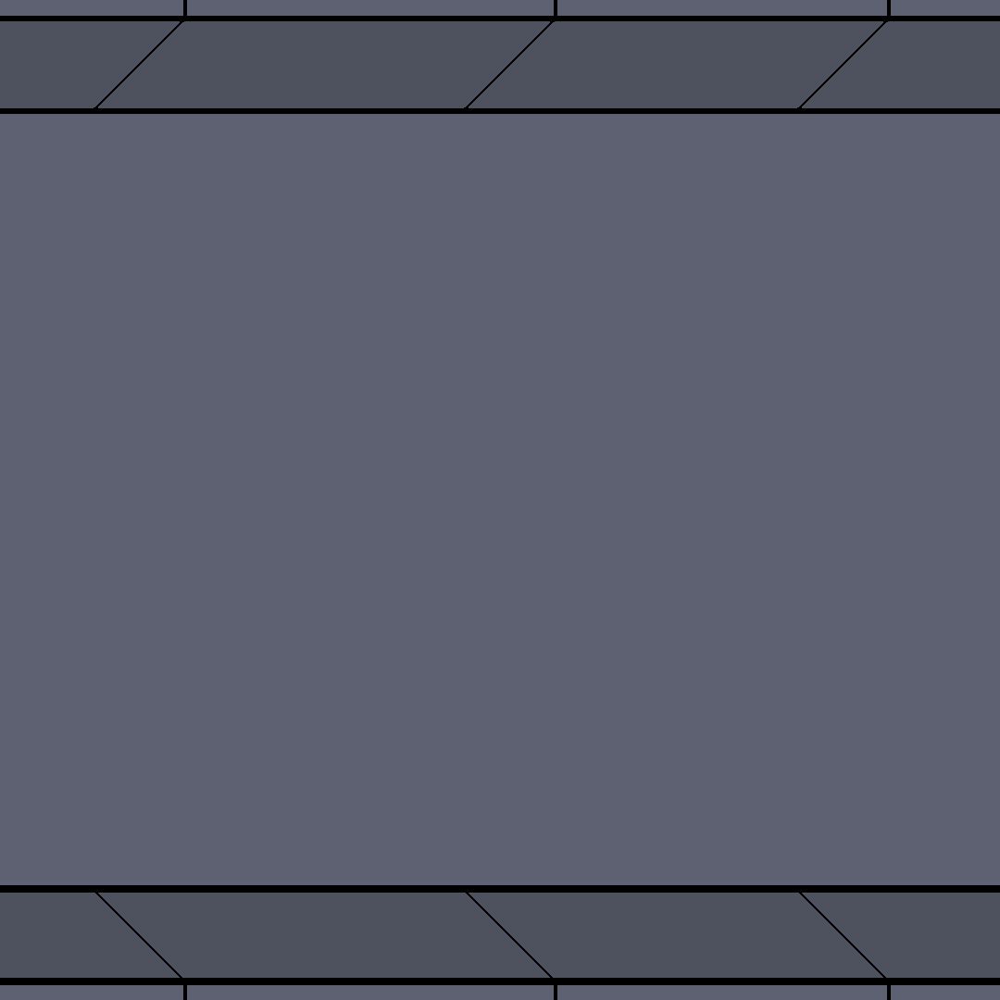

# ROCKET RIFT (Art Bible)

## Table of content

- [Other Design Documents](#other-design-documents)
- [Art Style](#art-style)
  - [General](#general)
  - [Visual Hook](#visual-hook)
  - [2D](#2d)
- [Characters](#characters)
- [Entities](#entities)
- [Environments](#environments)
- [Camera](#camera)
- [Marketing](#marketing)
- [Technical Guidelines](#technical-guidelines)
  - [Software](#software)
  - [File Formats](#file-formats)
  - [Restrictions](#restrictions)
  - [Naming Conventions](#naming-conventions)
  - [Workflows](#workflows)

## Other Design Documents

- [GDD](../game-design-document/gdd.md)
- [LDD](../level-design-document/ldd.md)
- [ADD](../audio-design-document/add.md)

## Art Style

### General

The art style will will first take inspiration of the original, but still be original.

I will also try to get my nephew in somehow, maybe as the main character.

## Visual Hook

It will be pixel art as the original.

## 2D

- 2D sidescrolling
- Colorful
- Cartoony

## Characters

### Isaac Jordan

## Entities

### Zappers

### Missile

## Environments

To keep the scope down this remake is only going to have a simple room included.

### Menu section

The first section is the menu part and where the player starts. The resolution is 1080x1080, and is divided into 2 parts:

### Endless section

The other section is the same image repeating endlessly. It's squared (1080x1080 or 1:1), and similar tiles can be created to randomize the background a bit.

## Camera

Side-scrolling camera.

## Marketing

### Icon

## Technical Guidelines

### Software

- `Krita`
- `Aseprite`

### File Formats

- 2D assets: `.png`

### Restrictions

Keep the size of the files as small as possible.

One limitation is GitHub's size limit for single files: 100MB.

The base resolution is 1920x1080 (16:9), and all game assets that covers the whole screen should be in this size.

### Naming Conventions

As Godot's naming convention: [snake_case](https://docs.godotengine.org/en/stable/tutorials/scripting/gdscript/gdscript_styleguide.html#naming-conventions).

### Workflows

What are the workflows for creating any assets mentioned in this art bible?
